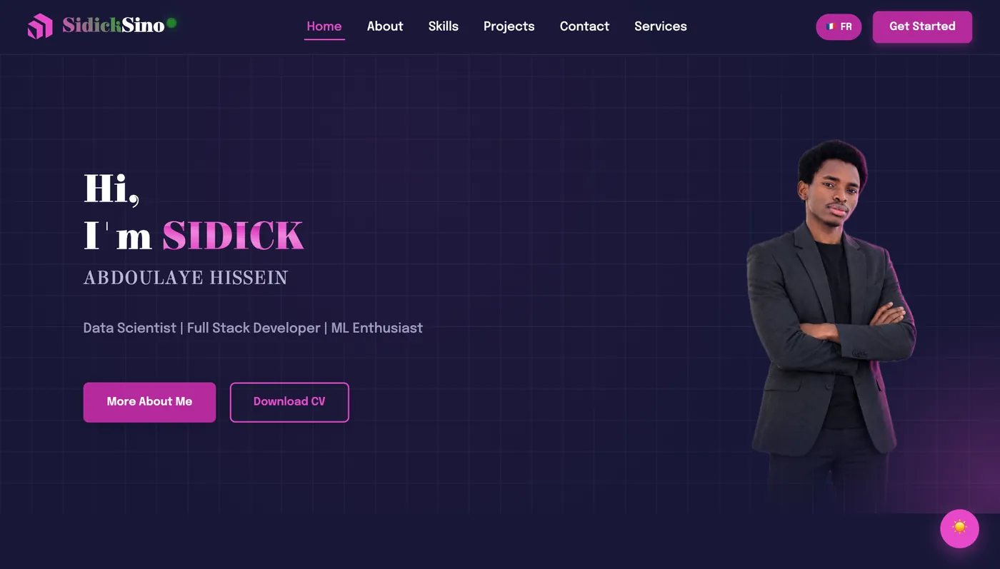
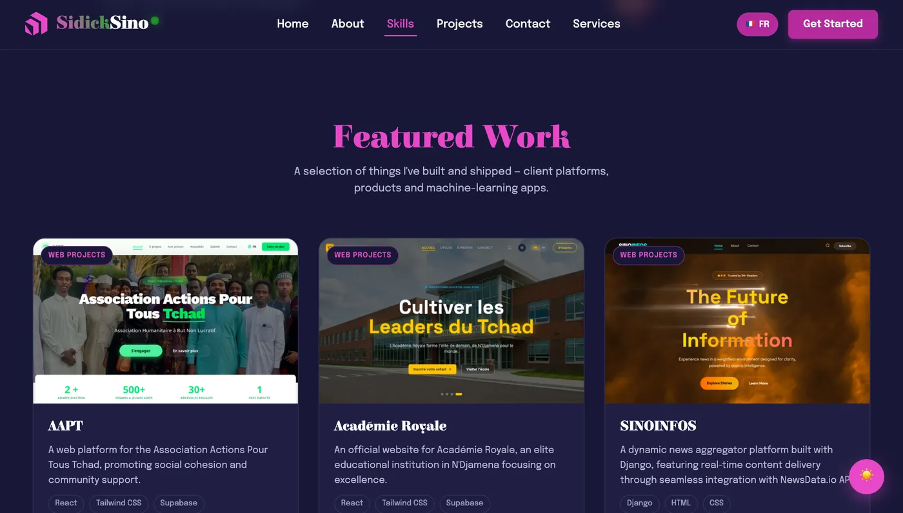

# Sidick Sino — Portfolio

Personal portfolio of **Sidick Abdoulaye Hissein** — Data Scientist and
Full-Stack Developer based between N'Djamena, Chad and Kigali, Rwanda.

**Live:** <https://sidick.vercel.app>



A bilingual (English / French) single-page site with a dark and light theme,
featuring 19 shipped projects across web, mobile, design and machine learning.



---

## Stack

| | |
|---|---|
| **Framework** | React 19 + Vite 7 |
| **Routing** | React Router 7 |
| **i18n** | i18next / react-i18next — English + French |
| **Styling** | Hand-written CSS with a design-token system, Tailwind v4 available |
| **Motion** | Framer Motion, GSAP (ScrollTrigger) |
| **Forms** | EmailJS + SweetAlert2 |
| **SEO** | react-helmet-async, sitemap.xml, robots.txt |
| **Hosting** | Vercel |

## Running it

Requires Node 18+.

```bash
npm install     # postinstall scripts must be approved — see note below
npm run dev     # http://localhost:5173
```

| Script | Does |
|---|---|
| `npm run dev` | Dev server with HMR |
| `npm run build` | Production build to `dist/` |
| `npm run preview` | Serve the production build locally |
| `npm run lint` | ESLint |

> **On `npm install`:** this project pins `legacy-peer-deps=true` in `.npmrc`,
> and `package.json` carries an `allowScripts` block for `esbuild`,
> `@tailwindcss/oxide` and `fsevents`. Those postinstall scripts unpack native
> binaries — **the build fails without them**, so keep that block.

## Layout

```
src/
├─ index.css              ← design tokens. The single source of truth.
├─ i18n.js                ← i18next setup; also keeps <html lang> in sync
├─ App.jsx                ← routes
├─ data/
│  ├─ projectData.js      ← all 19 projects + the homepage `featuredProjects` list
│  └─ siteData.js         ← skills, service and category metadata
├─ locales/               ← en.json / fr.json (keys must stay in parity)
└─ components/
   ├─ hero/  about/  skills/       ← homepage sections
   ├─ featured/                    ← the featured-work grid
   ├─ project/  projects/          ← category cards + per-category pages
   └─ contact/  footer/  navbar/
```

### Two conventions worth knowing

**All design tokens live in `src/index.css`.** No other stylesheet may declare
`:root`. Colours, spacing, type and radii are tokens — component CSS consumes
them and never hard-codes a hex value.

**Content is data, not markup.** Projects, skills and services are defined in
`src/data/`, and every user-facing string is a key in `src/locales/`. To change
what the homepage features, edit the `featuredProjects` array in
`projectData.js` — it references existing projects by id, so nothing is
duplicated.

## Contributing to this repo

- `plan.md` tracks the ongoing improvement work, phase by phase, with what was
  measured and why.
- `.claude/skills/portfolio-design/` holds the design system rules — read it
  before changing anything visual.
- Verify changes by **running the site and looking at it**, in both themes and
  at 390px, not just by reading the CSS. Several bugs here were invisible in the
  source and obvious in the browser.

## Licence

No licence granted. The code is public for reference; the content, images and
personal branding are not free to reuse.
